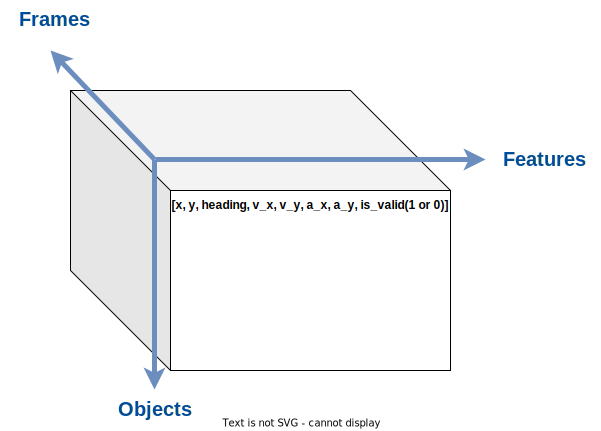
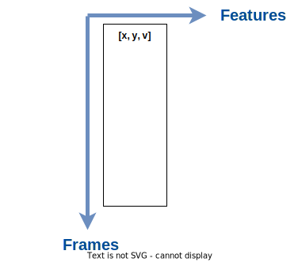

# Dataset Preprocessing

## File system hierarchy
The final hierarchy should look as follows (depending on the splits downloaded above):

```shell
nuplan_explore
├── converted_dataset
│   └── <scenarios>
│       ├── look_ahead_pt_array.npy
│       └── observation_array.npy
├── dataset_conversion.py
├── dataset_playground.ipynb
├── docs
├── evaluate_dataset.ipynb
├── nuplan
├── nuplan-devkit
├── README.md
└── Schema_review.xmind
```

## Data shape

### Input



```python
# load input file
with open(dataset_root + scenario_type + '/observation_array.npy', 'rb') as f:
    observation = np.load(f, allow_pickle=True)
observation.shape # (frames, objects, features)
```

#### Configuration

- ROI radius: 1000
- Number of objects: 10

#### Notice

- (x, y, heading) is w.r.t. **UTM**.
- (v_x, v_y) for ego car is w.r.t. **BEV**; (v_x, v_y) for other car is w.r.t. **UTM**.

### Output



```python
# load ouput file
with open(dataset_root + scenario_type + '/look_ahead_pt_array.npy', 'rb') as f:
    look_ahead_pt_array = np.load(f, allow_pickle=True)
look_ahead_pt_array.shape # (frames, features)
```

#### Configuration

- future time horizon: 5

## Scenario distribution

### mini


